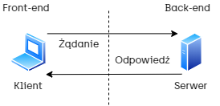
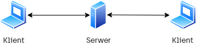
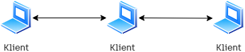
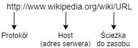
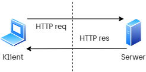
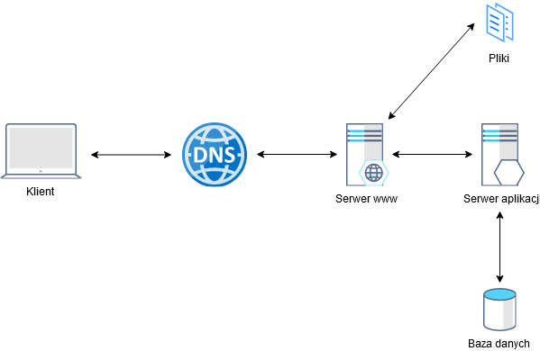
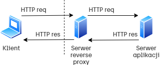
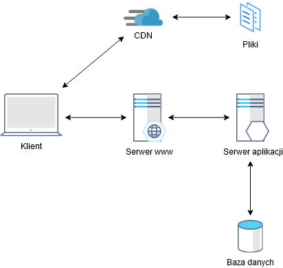

# Podstawy tworzenia aplikacji internetowych

---

**Aplikacja internetowa** (ang. web application) jest to aplikacja działająca w modelu klient-serwer, w którym klientem najczęściej jest przeglądarka internetowa. Przykładami aplikacji internetowych są klient poczty email, aplikacje bankowe dostępne przez Internet, sklepy internetowe czy też aplikacje biurowe, takie jak Office 365. 

---

---

**Klient-serwer** (ang. client/server, client-server model) – architektura systemu komputerowego, w szczególności oprogramowania, umożliwiająca podział zadań (ról). Polega to na ustaleniu, że serwer zapewnia usługi dla klientów, zgłaszających do serwera żądania obsługi (ang. service request).

*Źródło: Wikipedia*

---

---

**Peer-to-peer** (P2P, osoba do osoby) – model komunikacji w sieci komputerowej zapewniający wszystkim hostom te same uprawnienia, w odróżnieniu od architektury klient-serwer.

*Żródło: Wikipedia*

---

---

**Gniazdo** (ang. socket) – pojęcie abstrakcyjne reprezentujące dwukierunkowy punkt końcowy połączenia. Dwukierunkowość oznacza możliwość wysyłania i odbierania danych. Wykorzystywane jest przez aplikacje do komunikowania się przez sieć w ramach komunikacji międzyprocesowej. 

*Żródło: Wikipedia*

---

**URL** (ang. Uniform Resource Locator) – oznacza ujednolicony format adresowania (określania lokalizacji) zasobów (informacji, danych, usług) stosowany w Internecie i w sieciach lokalnych

*Źródło: Wikipedia*

---

*Źródło: Wikipedia*

---

**HTTP** (ang. Hypertext Transfer Protocol) – protokół przesyłania dokumentów hipertekstowych.

*Żródło: Wikipedia*

---

---

*Źródło: https://www.ntu.edu.sg/home/ehchua/programming/webprogramming/HTTP_Basics.html*

---

**HTTPS** (ang. Hypertext Transfer Protocol Secure) – szyfrowana wersja protokołu HTTP korzystająca z kryptograficznego protokołu TLS lub dawniej z SSL.

*Żródło: Wikipedia*

---

**System nazw domen** (ang. Domain Name System, DNS) - hierarchiczny i zdecentralizowany system nazw dla komputerów, usług lub innych zasobów podłączonych do Internetu.

---

---

**Serwer WWW** (ang.) web server – program działający na serwerze internetowym, obsługujący żądania protokołu komunikacyjnego HTTP. Z serwerem WWW łączy się, poprzez sieć komputerową, przeglądarka internetowa, będąca jego klientem, aby pobrać wskazaną stronę WWW.

*Żródło: Wikipedia*

---

**Serwer reverse proxy** (ang. Reverse Proxy Server) - serwer pośredniczący umieszczony zazwyczaj w prywatnej sieci za zaporą sieciową (ang. firewall), przekazujący żądania do serwera odpowiedzialnego za ich przetworzenie (ang. back-end server).

---

---

**Sieć dostarczania treści** (ang. Content Delivery Network, CDN) - geograficznie rozproszona sieć serwerów proxy i powiązanych centrów danych służąca udostępnianiu treści z wysoką wydajnością oraz dostępnością.

---

---

**Równoważenie obciążenia** (ang. Load balancing) - technika rozpraszania obciążenia na wiele serwerów lub procesorów.

