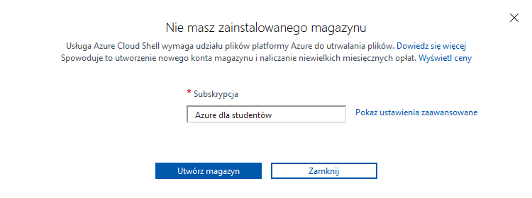
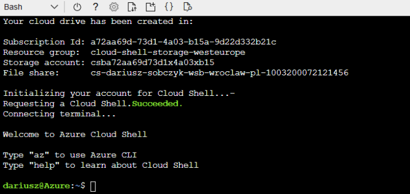
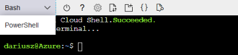

# Praca z platformą Azure

## Logowanie na platformie Azure

Zaloguj się do [portalu Azure](https://portal.azure.com) za pomocą swojego adresu e-mail w domenie uczelni.

## Aktywacja subskrypcji

Po zalogowaniu, skonfiguruj swoją subskrypcję dla studentów. W tym celu przejdź na stronę [Azure dla studentów](https://azure.microsoft.com/pl-pl/free/students/) i kliknij przycisk Aktywuj teraz. Po przeniesieniu do nowej strony, wypełnij formularz i aktywuj subskrypcję.

## Sprawdzanie dostępnych środków

Stan środków dla subskrypcji dla studentów można sprawdzić pod [tym adresem](https://www.microsoftazuresponsorships.com/). Po otwarciu strony, kliknij na **Check your balance**.

## Praca z usługą Azure Cloud Shell

Usługa Azure Cloud Shell umożliwia zarządzanie zasobami platformy Azure z poziomu wiersza poleceń (Bash lub PowerShell) bezpośrednio w przeglądarce internetowej.

### Logowanie do usługi

Przejdź na stronę usługi [Azure Cloud Shell](https://shell.azure.com). Jeżeli nie jesteś zalogowany na platformie Azure, zaloguj się teraz.

### Tworzenie magazynu

Jeżeli wcześniej nie korzystałeś z usługi Azure Cloud Shell, wyświetli się komunikat o braku zainstalowanego magazynu.



Kliknij na przycisk **Utwórz magazyn** aby utworzyć magazyn a następnie przejść do interaktywnego terminala.



Wszystkie polecenia na ćwiczeniach będą wykonywane w powłoce Bash. Do przełączania się między powłokami służy menu znajdujące się w lewym górnym rogu usługi Azure Cloud Shell.



## Zarządzanie maszynami wirtualnymi

Wszystkie poniższe kroki należy wykonać z poziomu Azure Cloud Shell korzystając z narzędzi wiersza poleceń Azure CLI. Dla każdego polecenia można uzyskać szczegółową pomoc dodając argument `--help`.

**Wartości w nawiasach ostrych należy zmienić na swoje własne.**

Utwórz grupę zasobów o dowolnej nazwie:

```sh
az group create \
  --name <nazwa-grupy-zasobów> \
  --location westeurope
```

Utwórz maszynę wirtualną o dowolnej nazwie:

```sh
az vm create \
  --resource-group <nazwa-grupy-zasobów> \
  --name <nazwa-maszyny-wirtualnej> \
  --size Standard_B2s \
  --image UbuntuLTS \
  --admin-username <nazwa-użytkownika> \
  --generate-ssh-keys
```

Zaloguj się do utworzonej maszyny wirtualnej korzystając z SSH:

```sh
ssh <nazwa-użytkownika>@<adres-ip-maszyny-wirtualnej>
```

Adres maszyny wirtualnej można pobrać poleceniem `az vm list-ip-addresses` (kolumna `PublicIPAddresses`):

```sh
az vm list-ip-addresses \
  --resource-group <nazwa-grupy-zasobów> \
  --name <nazwa-maszyny-wirtualnej> \
  --output table
```

Wyloguj się z maszyny wirtualnej:

```sh
logout
```

Usuń maszynę wirtualną:

```sh
az vm delete \
  --resource-group <nazwa-groupy-zasobów> \
  --name <nazwa-maszyny-wirtualnej>
```

Usuń grupę zasobów:

```sh
az group delete \
  --name <nazwa-grupy-zasobów>
  --yes
  --no-wait
```

Usunięcie grupy zasobów powoduje również usunięcie wszystkich zasobów z tej grupy. Nie ma więc potrzeby usuwania maszyny wirtualnej przed usunięciem grupy zasobów.