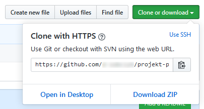

# Tworzenie i wdrażanie aplikacji w Node.js

## Zadanie 1
Utwórz konto w serwisie [GitHub](https://github.com). Jeżeli posiadasz już konto, możesz użyć na zajęciach. Utwórz nowe repozytorium z poniższymi ustawieniami:


## Zadanie 2
Utwórz maszynę wirtualną z systemem Ubuntu i zainstaluj na niej narzędzia Azure CLI i NVM (Node Version Manager). Następnie korzystajć z NVM zainstaluj Node.js w wersji 10.15.

1. Utwórz grupę zasobów:

```sh
az group create \
  --name <nazwa-grupy-zasobów> \
  --location westeurope
```

2. Utwórz maszynę wirtualną:

```sh
az vm create \
  --resource-group <nazwa-grupy-zasobów> \
  --name <nazwa-maszyny-wirtualnej> \
  --size Standard_B1s \
  --image UbuntuLTS \
  --admin-username <nazwa-użytkownika> \
  --generate-ssh-keys
```

3. Pobierz publiczny adres IP maszyny wirtualnej:

```sh
az vm list-ip-addresses \
  --resource-group <nazwa-grupy-zasobów> \
  --name <nazwa-maszyny-wirtualnej> \
  --output table
```

4. Zaloguj się przez SSH do maszyny wirtualnej:

```sh
ssh <nazwa-użytkownika>@<adres-ip-maszyny-wirtualnej>
```

5. Zainstaluj Azure CLI:

```sh
curl -sL https://aka.ms/InstallAzureCLIDeb | sudo bash
```

6. Zainstaluj NVM:

```sh
curl -o- https://raw.githubusercontent.com/nvm-sh/nvm/v0.35.2/install.sh | bash
```

Wyloguj a następnie zaloguj się ponowanie do maszyny wirtualnej.

7. Zainstaluj Node.js:

```sh
nvm install 10.15
```

## Zadanie 3
Sklonuj projekt z serwisu GitHub. W katalogu projektu wygeneruj aplikację korzystając z narzędzia koa-generator i przetestuj jej działanie lokalnie. Utwórz aplikację internetową w usłudze Azure App Service i wdróż do niej utworzony projekt korzystając z opcji wdrażania z lokalnych repozytoriów Git. Przetestuj jej działanie w przeglądarce internetowej. Zatwierdź zmiany w projekcie (git commit) a następnie wypchnij je do repozytorium w serwisie GitHub.

1. Pobierz adres URL repozytorium z serwisu GitHub:



2. Sklonuj repozytorium projektu:

```sh
git clone <adres-url-repozytorium>
```

3. Przejdź do katalogu z projektem:

```sh
cd projekt-paa
```

4. Wygeneruj aplikację narzędziem koa-generator:

```sh
npx koa-generator
```

5. Zainstaluj zależności:

```sh
npm install
```

6. Zaloguj się do Azure:

```sh
az login
```

Postępuj zgodnie z instrukcją wyświetloną na ekranie.

7. Otwórz port na maszynie wirtualnej:

```sh
az vm open-port \
  --resource-group <nazwa-grupy-zasobów> \
  --name <nazwa-maszyny-wirtualnej> \
  --port 3000
```

8. Uruchom aplikację:

```sh
npm start
```

9. Otwórz przeglądarkę internetową i sprawdź działanie aplikacji:


10. Zatrzymaj aplikację skrótem klawiszowym `ctrl+c`.

11. Utwórz plan usługi App Service:

```sh
az appservice plan create \
  --resource-group <nazwa-grupy-zasobów> \
  --name <nazwa-planu> \
  --sku FREE
```

12. Utwórz aplikację usługi App Service:

```sh
az webapp create \
  --resource-group <nazwa-grupy-zasobów> \
  --plan <nazwa-planu> \
  --name <nazwa-aplikacji> \
  --runtime "node|10.15" \
  --deployment-local-git
```

13. Skonfiguruj użytkownika wdrożenia

```sh
az webapp deployment user set \
  --user-name <nazwa-użytkownika> \
  --password <hasło-użytkownika>
```

14. Pobierz URL repozytorium wdrożenia:

```sh
url=$(az webapp deployment source config-local-git \
  --resource-group <nazwa-grupy-zasobów> \
  --name <nazwa-aplikacji> \
  --query url \
  --output tsv)
```

15. Dodaj repozytorium zdalne:

```sh
git remote add azure $url
```

16. Ustaw użytkownika Git (dwa polecenia):

```sh
git config --global user.name "<imię-i-nazwisko>"
git config --global user.email "<adres-email>"
```

17. Dodaj pliki:

```sh
git add --all
```

18. Zatwierdź zmianę:

```sh
git commit -m 'Utworzono projekt'
```

19. Wypchnij zmiany do repozytorium aplikacji App Service:

```sh
git push azure master
```

20. Otwórz przeglądarkę internetową i sprawdź działanie aplikacji:


21. Wypchij zmiany do repozytorium GitHub:

```sh
git push origin master
```