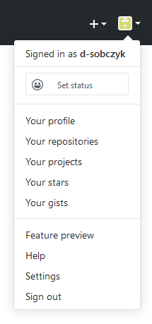
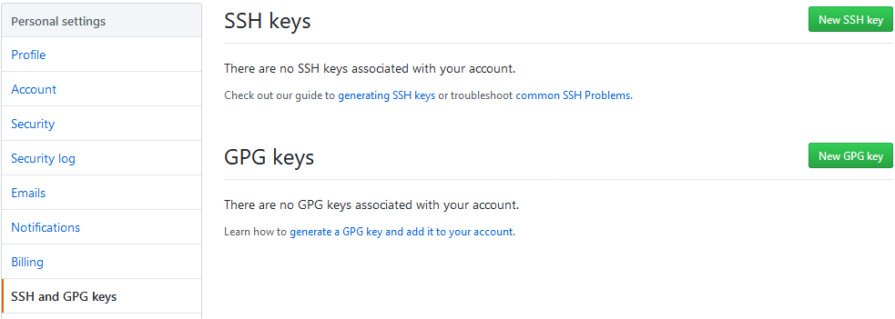
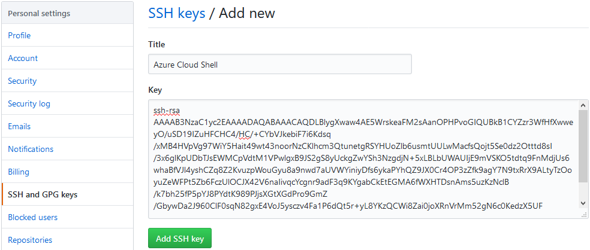
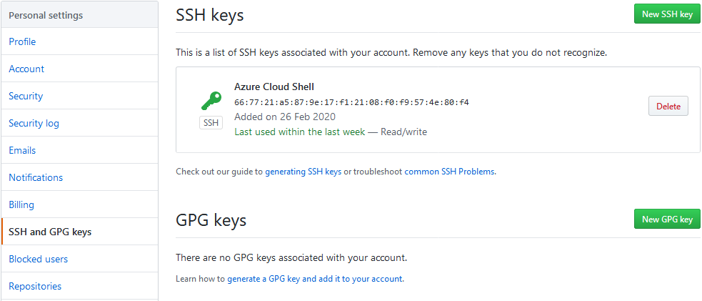
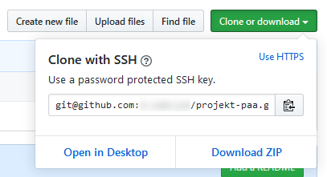

# Praca z repozytoriami w serwisie GitHub

## Zadanie 1
Skonfiguruj dostęp do repozytoriów w serwisie GitHub za pomocą klucza SSH. Usuń niepotrzebne pliki z repozytorium dodane podczas tworzenia repozytorium i generowania aplikacji. Dodaj plik README.md i wypchnij zmiany do repozytorium w serwisie GitHub.

1. Utwórz parę kluczy SSH:

```sh
ssh-keygen -t rsa -b 4096 -C "<adres-email>"
```

Na pytanie o ścieżkę podaj /home/<nazwa-użytkownika>/.ssh/github. Na pytanie o hasło (passphrase) naciśnij klawisz Enter albo podaj hasło zabezpieczające klucz.

2. Sprawdź czy para kluczy została utworzona:

```sh
ls -l ~/.ssh
```

Powinny znajdować się tam dwa pliki o nazwach `github` i `github.pub`.

3. Wyświetl klucz publiczny:

```sh
cat ~/.ssh/github.pub
```

4. Skopiuj zawartość klucza publicznego do schowka.

5. Przejdź do serwisu GitHub i z menu w prawym górym rogu wybierz *Settings*:



6. Przejdź do zakładki *Settings* a następnie *SSH and GPG keys*:



7. Kliknij przycisk *New SSH key*.

8. W polu *Title* podaj nazwę klucza *Azure Cloud Shell*. W polu *Key* wklej klucz publiczny ze schowka. Kliknij przycisk *Add SSH key*:



9. Sprawdź czy na liście kluczy pojawił się nowy wpis:



10. Edytuj plik z ustawieniami SSH:

```sh
nano ~/.ssh/config
```

11. Wklej następującą konfigurację:

```sh
Host github.com
  Hostname github.com
  User git
  IdentityFile ~/.ssh/github
```

12. Przejdź do repozytorium w serwisie [GitHub](https://github.com) i skopiuj adres klonowania SSH:



13. Zmień adres zdalnego repozytorium:

```sh
git remote set-url origin <adres-url-repozytorium>
```

14. Usuń wszystkie pliki i katalogi, które nie znajdują się na poniższej liście:

```sh
drwxrwxr-x   8 zajecia zajecia   4096 Mar  4 09:18 .
drwxr-xr-x  10 zajecia zajecia   4096 Mar  4 09:17 ..
drwxrwxr-x   8 zajecia zajecia   4096 Mar  4 11:01 .git
-rw-rw-r--   1 zajecia zajecia   1610 Mar  4 09:16 .gitignore
-rw-rw-r--   1 zajecia zajecia   1072 Mar  4 09:16 LICENSE
-rw-rw-r--   1 zajecia zajecia    900 Mar  4 09:16 app.js
drwxr-xr-x   2 zajecia zajecia   4096 Mar  4 09:16 bin
drwxrwxr-x 287 zajecia zajecia  12288 Mar  4 09:18 node_modules
-rw-rw-r--   1 zajecia zajecia 121443 Mar  4 09:18 package-lock.json
-rw-rw-r--   1 zajecia zajecia    619 Mar  4 09:18 package.json
drwxr-xr-x   5 zajecia zajecia   4096 Mar  4 09:16 public
drwxr-xr-x   2 zajecia zajecia   4096 Mar  4 09:16 routes
drwxr-xr-x   2 zajecia zajecia   4096 Mar  4 09:16 views
```

Użyj polecenia `ls -la` aby wylistować zawartość katalogu.

15. Dodaj pliki:

```sh
git add --all
```

16. Zatwierdź zmianę:

```sh
git commit -m "Usunięto zbędne pliki"
```

17. Utwórz plik README.md:

```sh
touch README.md
```

18. Dodaj plik:

```sh
git add README.md
```

19. Zatwierdź zmianę:

```sh
git commit -m "Dodano plik README"
```

20. Wypchnij zmiany do repozytorium w serwisie GitHub:

```sh
git push origin master
```

## Zadanie 2
Utwórz nową gałąź o nazwie *develop* w repozytorium lokalnym i wypchnij ją do repozytorium w serwisie GitHub.

## Zadanie 3
Zmodyfikuj historię repozytorium tak, aby znajdowały się w niej dwie zmiany. Najstarsza o treści Utworzenie projektu w której znajdują się pliki projektu wygenerowane na poprzednich zajęciach. Druga o treści Dodano plik README.