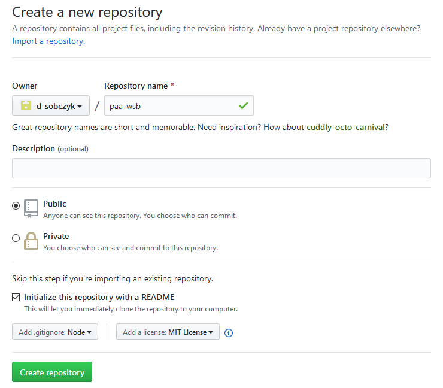
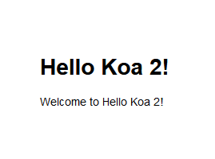

# Tworzenie i wdrażanie aplikacji

## Tworzenie konta w serwisie GitHub

Utwórz konto na platformie [GitHub](https://github.com). Jeżeli posiadasz już konto, możesz użyć je do pracy nad projektem.

## Tworzenie repozytorium w serwise GitHub

Zaloguj się w serwisie [GitHub](https://github.com) i utwórz nowe repozytorium git tak jak na poniższym zrzucie ekranu (podaj dowolną nazwę repozytorium).



## Tworzenie środowiska pracy

Zaloguj się do [Azure Cloud Shell](https://shell.azure.com). Upewnij się, że korzystasz ze środowiska **Bash**.

**Tworzenie maszyny wirtualnej**

 Utwórz grupę zasobów:

```sh
az group create \
  --name <grupa-zasobów> \
  --location westeurope
```

Utwórz maszynę wirtualną:

```sh
az vm create \
  --resource-group <grupa-zasobów> \
  --name <nazwa-maszyny-wirtualnej> \
  --size Standard_B2s \
  --image UbuntuLTS \
  --admin-username <nazwa-użytkownika> \
  --generate-ssh-keys
```

Pobierz adres IP maszyny wirtualnej:

```sh
az vm list-ip-addresses \
  --resource-group <grupa-zasobów> \
  --name <nazwa-maszyny-wirtualnej> \
  --output table
```

Zaloguj się do maszyny wirtualnej:

```sh
ssh <nazwa-użytkownika>@<adres-ip-maszyny-wirtualnej>
```

**Instalacja oprogramowania**

Zainstaluj narzędzia Azure CLI:

```sh
curl -sL https://aka.ms/InstallAzureCLIDeb | sudo bash
```

Zainstaluj Node Version Manager:

```sh
curl -o- https://raw.githubusercontent.com/nvm-sh/nvm/v0.35.2/install.sh | bash
```

Wyloguj się a następnie zaloguj ponownie do maszyny wirtualnej aby móc korzystać z poleceń `az` i `nvm`.

Zainstaluj Node.js w najnowszej wersji LTS:

```sh
nvm install --lts
```

```sh
git config --global user.name "<imię-i-nazwisko>"
git config --global user.email "<adres-email>"
```

Ściągnij repozytorium git utworzone w serwisie GitHub na maszynę wirtualną:

```sh
git clone <url-repozytorium>
```

Adres (URL) repozytorium znajdziesz na karcie repozytorium w serwisie [GitHub](https://github.com). Po ściągnięciu repozytorium, w katalogu bieżącym powinien pojawić się nowy katalog o tej samej nazwie co nazwa repozytorium. Przejdź do tego katalogu:

```sh
cd <nazwa-repozytorium>
```

## Tworzenie i uruchamianie aplikacji w Node.js lokalnie

**Tworzenie aplikacji**

Zainstaluj globalną zależność `koa-generator`:

```sh
npm install -g koa-generator
```

Wygeneruj projekt startowy:

```sh
koa2 .
```

Zainstaluj lokalne zależności:

```sh
npm install
```

**Otwieranie portów maszyny wirtualnej**

Zaloguj się w Azure w wierszu poleceń:

```sh
az login
```

```sh
az vm open-port \
  --resource-group <grupa-zasobów> \
  --name <nazwa-maszyny-wirtualnej> \
  --port 3000
```

**Uruchomienie aplikacji**

Uruchom aplikację:

```sh
npm start
```

Otwórz stronę pod adresem `<ip-maszyny-wirtualnej>:3000`. Załadowana strona powinna zawierać treść zgodną z poniższym zrzutem ekranu.



Działanie aplikacji możesz zatrzymać używając skrótu `Ctrl+C`.

## Wdrożenie aplikacji w usłudze Azure App Service

**Tworzenie aplikacji**

Utwórz plan usługi Azure App Service:

```sh
az appservice plan create \
  --resource-group <grupa-zasobów> \
  --name <nazwa-planu> \
  --sku FREE
```

Utwórz nową aplikację:

```sh
az webapp create \
  --resource-group <grupa-zasobów> \
  --name <nazwa-aplikacji> \
  --plan <nazwa-planu> \
  --runtime "node|10.15"
```

**Wdrażanie aplikacji**

Utwórz użytkownika wdrożenia:

```sh
az webapp deployment user set \
  --user-name <nazwa-użytkownika> \
  --password <hasło-użytkownika>
```

Pobierz URL repozytorium dla wdrożenia:

```sh
az webapp deployment source config-local-git \
  --resource-group <grupa-zasobów> \
  --name <nazwa-aplikacji> \
  --query url \
  --output tsv
```

```sh
git remote add azure <url-repozytorium-wdrożenia>
```

Dodaj wszystkie pliki lokalne:

```sh
git add --all
```

Utwórz commit:

```sh
git commit -m 'Tworzenie i wdrażanie aplikacji'
```

Wypchnij zmiany do repozytorium usług Azure App Service:

```sh
git push azure master
```

Sprawdź czy aplikacja działa poprawnie przechodząc pod adres `<nazwa-aplikacji>.azurewebsites.net`

## Zapisanie projektu w serwisie GitHub

Wypchij zmiany do repozytorium w serwisie GitHub

```sh
git push origin master
```
