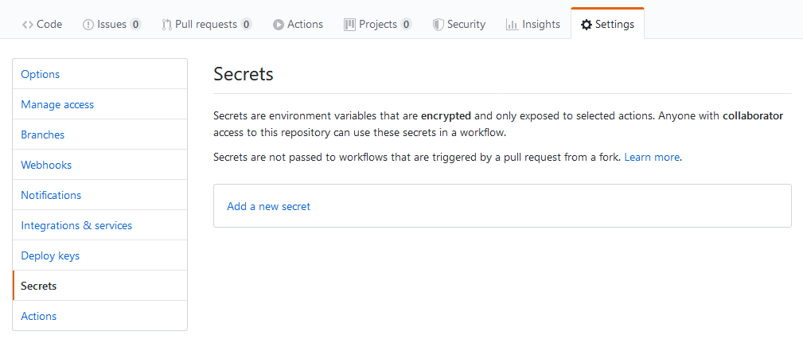
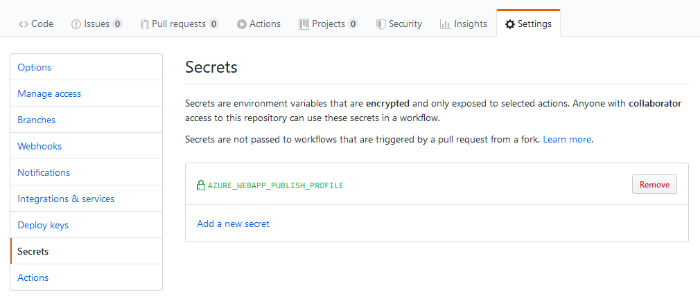
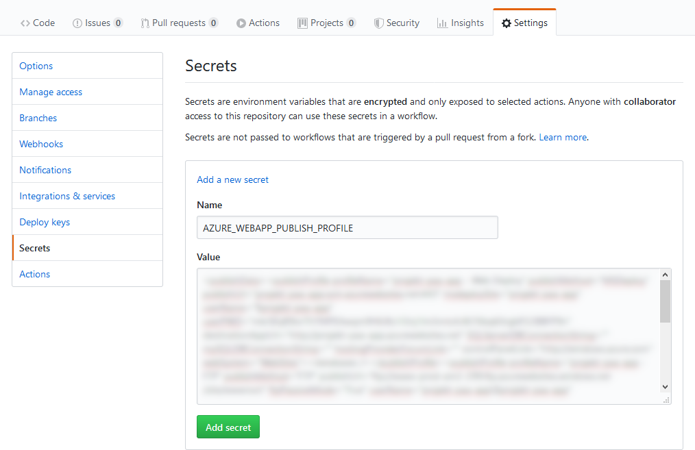
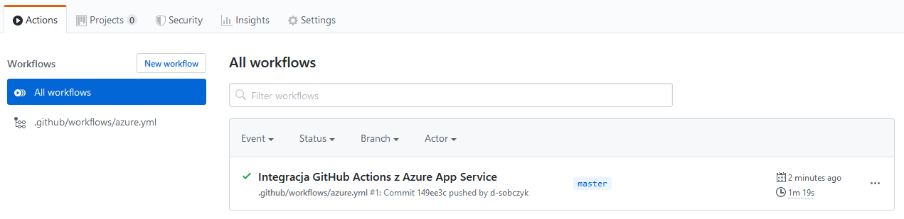

# Ciągłe wdrażanie z użyciem GitHub Actions

## Zadanie 1
Skonfiguruj wdrażanie aplikacji Azure App Service za pomocą funkcji GitHub Actions w taki sposób aby odbywało się na każde wypchnięcie zmian do gałęzi master.

1. Zaloguj się do maszyny wirtualnej:

```sh
ssh <nazwa-użytkownika>@<adres-ip-maszyny-wirtualnej>
```

2. Przejdź do katalogu projektu:

```sh
cd <nazwa-projektu>
```

3. Przełącz się na gałąź *master*:

```sh
git checkout master
```

4. Utwórz nowy katalog:

```sh
mkdir -p .github/workflows
```

5. Utwórz plik YAML:

```sh
touch .github/workflows/azure.yml
```

6. Otwórz plik YAML do edycji:

```sh
nano .github/workflows/azure.yml
```

7. Opisz zadanie wdrożenia:

```yaml
on:
  push:
    branches:
      - master

env:
  AZURE_WEBAPP_NAME: <nazwa-aplikacji>
  AZURE_WEBAPP_PACKAGE_PATH: '.'
  NODE_VERSION: '10.15'

jobs:
  build-and-deploy:
    name: Build and Deploy
    runs-on: ubuntu-latest
    steps:
    - uses: actions/checkout@v2
    - name: Use Node.js ${{ env.NODE_VERSION }}
      uses: actions/setup-node@v1
      with:
        node-version: ${{ env.NODE_VERSION }}
    - name: Install dependencies
      run: |
        npm install
    - name: 'Deploy to Azure WebApp'
      uses: azure/webapps-deploy@v1
      with:
        app-name: ${{ env.AZURE_WEBAPP_NAME }}
        publish-profile: ${{ secrets.AZURE_WEBAPP_PUBLISH_PROFILE }}
        package: ${{ env.AZURE_WEBAPP_PACKAGE_PATH }}

```

Zastąp `<nazwa-aplikacji>` nazwą swojej aplikacji App Service.

8. Pobierz profil publikowania aplikacji App Service z Azure Portal klikając przycisk *Pobierz profil publikowania* na stronie głównej aplikacji:


9. Otwórz pobrany plik i skopiuj jego zawartość do schowka.

10. Przejdź do repozytorium projektu w serwisie [GitHub](https://github.com) a następnie do zakładki *Settings* i *Secrets*:



11. Kliknij przycisk *Add new secret*. W polu *Name* wpisz AZURE_WEBAPP_PUBLISH_PROFILE a w polu *Value* wklej zawartość skopiowaną do schowka:



12. Kliknij przycisk *Add secret* i sprawdź czy na liście pojawił się nowy wpis:



13. Dodaj pliki:

```sh
git add .github/workflows/azure.yml
```

14. Zatwierdź zmianę:

```sh
git commit -m 'Dodano integrację z GitHub Actions'
```

15. Wypchnij zmiany do repozytorium w serwisie GitHub:

```sh
git push origin master
```

16. Przejdź do repozytorium projektu w serwisie GitHub a następnie do zakładki *Actions*. Sprawdź czy na liście znajduje się nowy wpis:



## Zadanie 2
Utwórz dodatkowe miejsce wdrożenia w aplikacji App Service o nazwie *deploy* oraz gałąź w repozytorium o tej samej nazwie. Skonfiguruj automatyczne wdrażanie aplikacji z GitHub do Azure App Service za pomocą funkcji GitHub Actions, które będzie się odbywać w momencie wypchnięcia zmian na gałęzi *deploy*.

## Zadanie 3
Utwórz nową gałąź o nazwie *test* z gałęzi *master*. Dodaj nowe zadanie o nazwie *Run tests* do pliku przepływu, które uruchomi testy aplikacji (polecenie npm run tests). Zatwierdź zmiany (git commit) z komunikatem o treści *Dodano automatyczne uruchamianie testów*. Wypchnij zmiany (git push) z gałęzi *test* do repozytorium w serwisie GitHub i sprawdź czy wykonanie nowej akcji zakończyło się niepowodzeniem.
