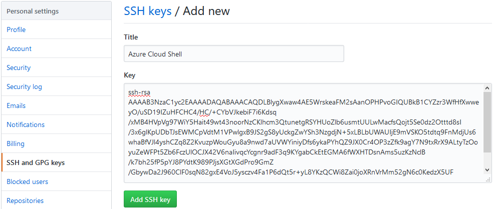
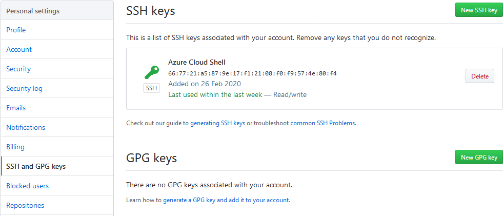

# Praca z Git w serwisie  GitHub

## Zmiana nazwy projektu

Zaloguj się do serwisu GitHub i przejdź do repozytorium, które utworzyłeś na poprzednich zajęciach. Przejdź do zakładki *Settings* i w polu *Repository name* wpisz *projekt-paa*. Zapisz zmiany klikając na przycisk *Rename*.


## Konfiguracja dostępu przez SSH

Aby móc pracować z repozytorium w serwisie GitHub bez podawania nazwy użytkownika oraz hasła, należy dodać publiczny klucz SSH w ustawieniach konta.

**Tworzenie nowego klucza SSH**
Zaloguj się do [Azure Cloud Shell](https://shell.azure.com) a następnie utwórz parę kluczy SSH przeznaczoną dla serwisu GitHub:

```sh
ssh-keygen -t rsa -b 4096 -C "<adres-email>"
```

Jako adres email podaj adres użyty do utworzenia konta w serwisie GitHub. Podczas pytania o ścieżkę do pliku wpisz `~/.ssh/github`. Podczas pytania o hasło (passphrase) wpisz dowolne hasło, które posłuży do ochrony klucza (pole można pozostawić puste, ale wpływa to na obniżenie bezpieczeństwa). Sprawdź czy para kluczy (pliki o nazwach github oraz github.pub) została utworzona:

```sh
ls ~/.ssh
```

**Dodawanie klucza publicznego w serwisie GitHub**
Wyświetl zawartość klucza publicznego w terminalu i skopiuj go do schowka:

```sh
cat ~/.ssh/github.pub
```

Przejdź do ustawień w serwisie GitHub. Z menu w lewym górnym rogu wybierz *Settings*.


Następnie przejdź do zakładki *SSH and GPG keys* i kliknij na przycisk *New SSH key*.


W polu *Title* podaj nazwę klucza (dowolna, np. Azure Cloud Shell). W polu *Key* wklej publiczny klucz SSH. Kliknij na przycisk *Add SSH key*




Na liście kluczy powinien znaleźć się twój klucz publiczny.



Przejdź do [Azure Cloud Shell](https://shell.azure.com) i edytuj plik z ustawieniami SSH:

```sh
nano ~/.ssh/config
```

Wklej następującą zawartość a następnie zapisz plik skrótem klawiszowym *ctrl+o* i zamknij edytor skrótem *ctrl+x* (potwierdź wyjście klawiszem *enter*):

```
Host github.com
  Hostname github.com
  User git
  IdentityFile ~/.ssh/github
```

Powyższe konfiguruje narzędzie SSH do korzystania z klucza o nazwie *github* do uwierzytelniania w serwisie GitHub.

Przejdź do strony repozytorium projektu. Kliknij przycisk *Clone or download*, przełącz na *Use SSH* i skopiuj adres repozytorium do schowka klikając przycisk obok adresu repozytorium.


Otwórz [Azure Cloud Shell](https://shell.azure.com) i sklonuj repozytorium:

```
git clone <adres-repozytorium>
```

Jeżeli podałeś hasło do klucza SSH (passphrase) podczas jego tworzenia, zostaniesz o nie zapytany. Po podaniu hasła, repozytorium zostanie sklonowane do katalogu bieżącego. Jeżeli zostałeś zapytany o nazwę użytkownika i hasło to znaczy, że klucz SSH nie został poprawnie dodany.

**Usuwanie plików z repozytorium**
Niektóre repozytoria zawierają pliki i katalogi dodane przez przypadek podczas pierwszych ćwiczeń. Lista plików i katalogów, które powinny znajdować się w repozytorium znajduje się na poniższym zrzucie ekranu:


Wszystkie pozostałe pliki i katalogi powinny zostać usunięte. Otwórz [Azure Cloud Shell](https://shell.azure.com) i przejdź do katalogu projektu:

```sh
cd projekt-paa
```

Wylistuj zawartość katalogu:

```sh
ls -l
```

Jeżeli widzisz pliki lub katalogi, które nie powinny znaleźć się w repozytorium usuń je. Do usunięcia pliku wykorzystaj polecenie `rm <nazwa-pliku>` a do usunięcia katalogu `rm -r <nazwa-katalogu>`. Po usunięciu, sprawdź status:

```sh
git status
```

Powinna wyświetlić się lista plików, które usunąłeś. Dodaj zmiany a następnie utwórz commit:

```sh
git add --all && git commit -m "Usuń zbędne pliki z repozytorium"
```

Wypchnij zmiany z repozytorium lokalnego do serwisu GitHub:

```sh
git push origin master
```

**Dodanie pliku README.md**

Otwórz [Azure Cloud Shell](https://shell.azure.com) i przejdź do katalogu projektu:

```sh
cd projekt-paa
```

Utwórz nowy plik *README.md* i otwórz go do edycji:

```sh
touch README.md && nano README.md
```

Dodaj plik do staging area a następnie utwórz nowy commit:

```sh
git add README.md && git commit -m "Dodaj plik README"
```

Wypchij zmiany z lokalnego repozytorium do serwisu GitHub:

```sh
git push origin master
```

Sprawdź w serwisie GitHub czy plik README.md znajduje się w repozytorium.

**Utworzenie gałęzi (na ocenę 4)**

Utwórz nową gałąź o nazwie *develop* w repozytorium lokalnym, a następnie wypchnij ją do repozytorium w serwisie GitHub.

**Zmiana treści commit message (na ocenę 5)**
Zmień lokalnie treść pierwszego commita na *Utworzenie projektu* w obu gałęziach a następnie wypchnij zmiany do repozytorium serwisu GitHub. Jeżeli posiadasz dwa commity (z poprzednich zajęć oraz usunięcie plików) złącz je w jeden o tej samej treści.
