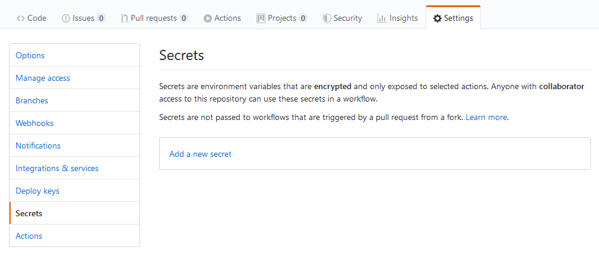
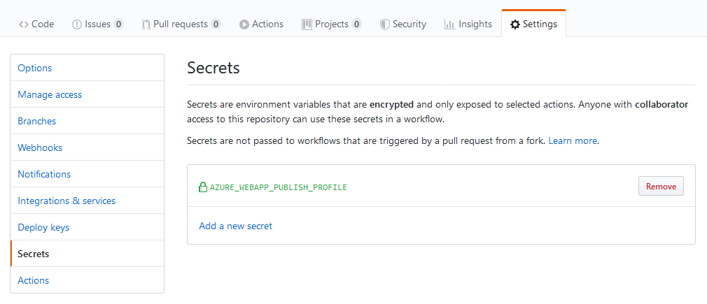

# Integracja GitHub Actions z Azure App Service

## 1. Ciągłe wdrażanie aplikacji w GitHub Actions

Zaloguj się do [Azure Cloud Shell](https://shell.azure.com) i przejdź do katalogu z projektem. Następnie utwórz nowy podkatalog:

```sh
mkdir -p .github/workflows
```

Utwórz plik konfiguracyjny YAML w nowo utworzonym katalogu i otwórz go do edycji:

```sh
touch .github/workflows/azure.yml && nano .github/workflows/azure.yml
```

Wklej poniższą konfigurację a następnie zmień wartość `nazwa-aplikacji` na nazwę twojej aplikacji w usłudze Azure App Service:

```YAML
on:
  push:
    branches:
      - master

env:
  AZURE_WEBAPP_NAME: nazwa-aplikacji
  AZURE_WEBAPP_PACKAGE_PATH: '.'
  NODE_VERSION: '10.15'

jobs:
  build-and-deploy:
    name: Build and Deploy
    runs-on: ubuntu-latest
    steps:
    - uses: actions/checkout@v2
    - name: Use Node.js ${{ env.NODE_VERSION }}
      uses: actions/setup-node@v1
      with:
        node-version: ${{ env.NODE_VERSION }}
    - name: Install dependencies
      run: |
        npm install
    - name: 'Deploy to Azure WebApp'
      uses: azure/webapps-deploy@v1
      with:
        app-name: ${{ env.AZURE_WEBAPP_NAME }}
        publish-profile: ${{ secrets.AZURE_WEBAPP_PUBLISH_PROFILE }}
        package: ${{ env.AZURE_WEBAPP_PACKAGE_PATH }}
```

Zapisz zmiany i zamknij edytor. Przejdź do aplikacji w [Azure Portal](https://portal.azure.com) a następnie pobierz profil publikowania klikając na przycisk *Pobierz profil publikowania*. Otwórz zapisany plik w dowolnym edytorze tekstu i skopiuj znajdujący się tam kod XML.

Przejdź do ustawień projektu na [GitHub](https://github.com) a następnie do zakładki *Secrets*.



Kliknij przycisk *Add a new secret*. W polu *Name* wpisz *AZURE_WEBAPP_PUBLISH_PROFILE* a w polu *Value* wklej skopiowany kod XML.


Kliknij przycisk *Add secret* aby zapisać zmiany. Na liście powinien pojawić się nowo utworzony wpis.



Przejdź do [Azure Cloud Shell](https://shell.azure.com) i utwórz commit z plikiem `azure.yml`:

```sh
git add .github/workflows/azure.yml
```

```sh
git commit -m 'Integracja GitHub Actions z Azure App Service'
```

Wypchij zmiany do repozytorium projektu na GitHub:

```sh
git push origin master
```

Przejdź do akcji projektu na [GitHub](https://github.com) i sprawdź czy na liście znajduje się utworzona akcja. Obserwuj status do momentu pomyślnego zakończenia.


## 2. Konfiguracja miejsc wdrożenia w App Service
Zmień plan usługi App Service na taki, który wspiera miejsca wdrożenia (ang. deployment slots). Utwórz nowe miejsce wdrożenia oraz nową gałąź w repozytorium projektu o nazwie *deploy* z gałęzi *master*. Zmodyfikuj plik *azure.yml* w taki sposób, aby wypchnięcie kodu na gałęzi *deploy* powodowało wdrożenie do miejsca (slotu) o tej samej nazwie. Wypchnij zmiany w gałęzi *deploy* do repozytorium w serwisie GitHub i sprawdź czy wdrożenie przebiegło pomyślnie. Udokumentuj cały proces (polecenia, zrzuty ekranu) w pliku README na gałęzi *deploy* i wypchnij zmianę do repozytorium w serwisie GitHub. Zmień plan usługi App Service z powrotem do warstwy darmowej (FREE).

## 3. Uruchamianie testów w GitHub Actions
Utwórz nową gałąź o nazwie *test* z gałęzi *master* i przełącz się na nią. Dodaj nowy krok o nazwie *Run tests* do pliku *azure.yml* który będzie uruchamiał testy poleceniem *npm run test*. Utwórz nowy commit o treści *Uruchom testy* i wypchij go do repozytorium w serwisie GitHub. Sprawdź czy krok został uruchomiony i czy cała akcja zakończyła się niepowodzeniem.


