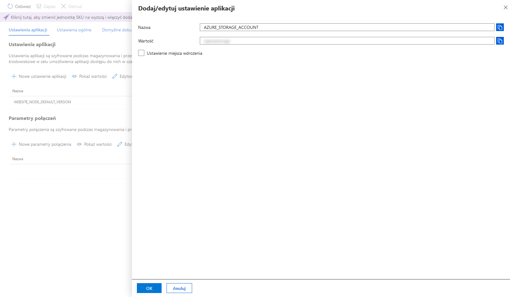
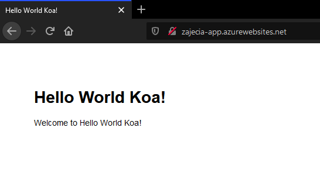

# Łączenie aplikacji z usługą Azure Table

## Materiały

* [Wprowadzenie do usługi Azure Table](https://docs.microsoft.com/en-us/azure/storage/tables/table-storage-overview)
* [Model danych w usłudze Azure Table](https://docs.microsoft.com/en-us/rest/api/storageservices/Understanding-the-Table-Service-Data-Model)
* [Tworzenie konta magazynu](https://docs.microsoft.com/en-us/azure/storage/common/storage-account-create?toc=https%3A%2F%2Fdocs.microsoft.com%2Fen-us%2Fazure%2Fstorage%2Ftables%2Ftoc.json&bc=https%3A%2F%2Fdocs.microsoft.com%2Fen-us%2Fazure%2Fbread%2Ftoc.json&tabs=azure-portal)
* [Dokumentacja SDK usługi Azure Table dla Node.js](https://docs.microsoft.com/en-us/azure/cosmos-db/table-storage-how-to-use-nodejs?toc=https%3A%2F%2Fdocs.microsoft.com%2Fen-us%2Fazure%2Fstorage%2Ftables%2Ftoc.json&bc=https%3A%2F%2Fdocs.microsoft.com%2Fen-us%2Fazure%2Fbread%2Ftoc.json)

## Przygotowanie

1. Otwórz [Azure Cloud Shell](https://shell.azure.com) i zaloguj się przez SSH do [maszyny wirtualnej utworzonej na pierwszych zajęciach](./PAA_C01.md):

```sh
ssh <nazwa-użytkownika>@<adres-ip-maszyny-wirtualnej>
```

2. Przejdź do katalogu projektu i przełącz się na gałąź *master*

```sh
cd projekt-paa && git checkout master
```

## Zadanie 1

Połącz aplikację z usługą Azure Table i utwórz nową tabelę o nazwie *tasks*.

1. Zainstaluj pakiet `azure-storage`:

```sh
npm install --save azure-storage
```

2. Utwórz plik o nazwie `store.js` w katalogu głównym projektu i otwórz go do edycji:

```sh
touch store.js && nano store.js
```

Wklej poniższy kod do pliku `store.js`:

```js
const storage = require('azure-storage')
const service = storage.createTableService()
const table = 'tasks'

const init = async () => (
  new Promise((resolve, reject) => {
    service.createTableIfNotExists(table, (error, result, response) => {
      !error ? resolve() : reject()
    })
  })
)

module.exports = {
  init
}
```

Zapisz zmiany i zamknij edytor.

3. Otwórz plik `app.js` do edycji:

```sh
nano app.js
```

Wklej poniższy kod w dowolnym miejscu w pliku `app.js`:

```js
require('./store').init()
```

Zapisz zmiany i zamknij edytor.

4. Utwórz nowe konto magazynu w tej samej grupie co aplikacja:

```sh
az storage account create \
  --resource-group <nazwa-grupy-zasobów> \
  --name <nazwa-magazynu> \
  --location westeurope \
  --sku Standard_LRS
```

Nazwa magazynu `<nazwa-magazynu>` musi być globalnie unikalna.

5. Wyświetl listę poświadczeń dla konta magazynu:

```sh
az storage account keys list \
  --resource-group <nazwa-grupy-zasobów> \
  --account-name <nazwa-magazynu> \
  --output table
```

6. Przejdź do aplikacji App Service w [Azure Portal](https://portal.azure.com) a następnie do zakładki *Konfiguracja*:


7. Dodaj nowe ustawienie `AZURE_STORAGE_ACCOUNT`:



W polu *Wartość* wpisz nazwę konta magazynu `<nazwa-konta>` utworzonego w kroku 4.

8. Dodaj nowe ustawienie `AZURE_STORAGE_ACCESS_KEY`:


W polu *Wartość* podaj wartość klucza poświadczeń `key1` pobranego w kroku 5 (kolumna `Value`).

9. Zapisz konfiguracją klikając przycisk *Zapisz*:


10. Zatwierdź zmiany w lokalnym repozytorium projektu:

```sh
git add --all && git commit -m 'Dodano połączenie z usługą Azure Storage'
```

11. Wypchnij zmiany z gałęzi `master` do repozytorium w serwisie GitHub:

```sh
git push origin master
```

12. Sprawdź czy aplikacja została poprawnie wdrożona przechodząc do zakładki *Actions* w repozytorium projektu w serwisie GitHub:


13. Otwórz aplikację w przeglądarce przechodząc pod adres `https://<nazwa-aplikacji>.azurewebsites.net`:



14. Przejdź do konta magazynu w Azure Portal a następnie do zakładki *Tabele*:


Sprawdź czy na liście tabel znajduje się tabela o nazwie `tasks`.

## Zadanie 2
Zaimplementuj ponawianie operacji na tabeli w przypadku niepowodzenia korzystając z filtrów dostępnych w SDK dla Node.js. Informacje na temat użycia filtrów znajdziesz w [oficjalnej dokumentacji](https://docs.microsoft.com/en-us/azure/cosmos-db/table-storage-how-to-use-nodejs?toc=https%3A%2F%2Fdocs.microsoft.com%2Fen-us%2Fazure%2Fstorage%2Ftables%2Ftoc.json&bc=https%3A%2F%2Fdocs.microsoft.com%2Fen-us%2Fazure%2Fbread%2Ftoc.json) w sekcji **Filters**. Wszystkie zmiany wypchnij do repozytorium w serwisie GitHub.

## Zadanie 3
Zaimplementuj logowanie na konsolę wszystkich operacji na tabeli. Do tego celu napisz swój własny filtr na wzór filtru ponawiania. Informacje na temat tworzenia filtrów znajdziesz w [oficjalnej dokumentacji](https://docs.microsoft.com/en-us/azure/cosmos-db/table-storage-how-to-use-nodejs?toc=https%3A%2F%2Fdocs.microsoft.com%2Fen-us%2Fazure%2Fstorage%2Ftables%2Ftoc.json&bc=https%3A%2F%2Fdocs.microsoft.com%2Fen-us%2Fazure%2Fbread%2Ftoc.json) w sekcji **Filters**. Do logowania użyj metody `console.log`. Poniżej znajduje się szkielet filtru logowania:

```js
function LoggingFilter() {
  this.handle = (requestOptions, next) => {
    // ...
    next(requestOptions, (returnObject, finalCallback, next) => {
      // ...
    })
  }
}
```

Aby uzyskać filtr logujący na konsolę należy dodać brakujący kod w miejscu komentarzy a następnie utworzyć serwis przekazując filtr logowania w wywołaniu `.withFilter`. Wszystkie zmiany wypchnij do repozytorium w serwisie GitHub.
