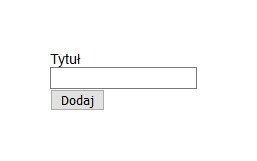

# Łączenie aplikacji z usługą Azure Table

## Materiały

* [Dokumentacja UUID](https://www.npmjs.com/package/uuid)
* [Dokumentacja koa-router](https://github.com/ZijianHe/koa-router)
* [Dokumentacja pug](https://pugjs.org/api/getting-started.html)

## Przygotowanie

1. Otwórz [Azure Cloud Shell](https://shell.azure.com) i zaloguj się przez SSH do [maszyny wirtualnej utworzonej na pierwszych zajęciach](./PAA_C01.md):

```sh
ssh <nazwa-użytkownika>@<adres-ip-maszyny-wirtualnej>
```

2. Przejdź do katalogu projektu i przełącz się na gałąź *master*

```sh
cd projekt-paa && git checkout master
```

## Zadanie 1

Na stronie głównej aplikacji umieść sekcję umożliwiającą użytkownikowi dodawanie nowych zadań do wykonania. Sekcja powinna składać się z jednego pola tekstowego w którym użytkownik może podać tytuł zadania oraz przycisk służący do zapisania zadania (dodanie wpisu do tabeli `tasks`). Wszystkie zmiany wypchnij do repozytorium projektu w serwisie GitHub.

1. Zainstaluj pakiet `UUID`:

```sh
npm install --save uuid
```

2. Utwórz plik `routes/tasks.js` i otwórz go do edycji:

```sh
touch routes/tasks.js && nano routes/tasks.js
```

Wklej poniższy kod do pliku `routes/tasks.js`:

```js
const router = require('koa-router')()
const store = require('../store')

router.prefix('/tasks')

router.post('/add', async (ctx, next) => {
  await store.createTask(ctx.request.body.title)
  ctx.redirect('/')
})

module.exports = router
```

Zapisz zmiany i zamknij edytor.

3. Otwóz plik `app.js` do edycji:

```sh
nano app.js
```

Zaimportuj plik `routes/tasks.js` w pliku `app.js`:

```js
const tasks = require('./routes/tasks')
```

Dodaj trasy do konfiguracji aplikacji w pliku `app.js`:

```js
app.use(tasks.routes(), tasks.allowedMethods())
```

Zapisz zmiany i zamknij edytor.

4. Otwórz plik `views/index.pug` do edycji:

```sh
nano views/index.pug
```

Zamień zawartość pliku `views/index.pug` na poniższą:

```pug
extends layout

block content
  form(action="/tasks/add", method="post")
    label(for="title")
      | Tytuł
    br
    input(type="text" id="title" name="title")
    br
    input(type="submit", value="Dodaj")
```

Zapisz zmiany i zamknij edytor.

5. Otwórz plik `store.js` do edycji:

```sh
nano store.js
```

Zaimportuj pakiet UUID:

```js
const uuid = require('uuid')
```

Dodaj poniższą implementację funkcji `createTask` w pliku `store.js`:

```js
const createTask = async (title) => (
  new Promise((resolve, reject) => {
    const generator = storage.TableUtilities.entityGenerator
    const task = {
      PartitionKey: generator.String('task'),
      RowKey: generator.String(uuid.v4()),
      title
    }

    service.insertEntity(table, task, (error, result, response) => {
      !error ? resolve() : reject()
    })
  })
)
```

Wyeksportuj funkcję `createTask` z pliku `store.js`:

```js
module.exports = {
  init,
  createTask
}
```

Zapisz zmiany i zamknij edytor.

6. Zatwierdź zmiany w repozytorium:

```sh
git add --all && git commit -m 'Dodano funkcję tworzenia zadań'
```

7. Wypchnij zmiany do repozytorium GitHub:

```sh
git push origin master
```

8. Po wdrożeniu aplikacji w usłudze App Service sprawdź czy strona główna wygląda tak jak na poniższym zrzucie ekranu:



Wpisz nazwę zadania i kliknij przycisk `Dodaj`. Strona powinna się odświeżyć i wrócić do stanu z powyższego zrzutu ekranu.

## Zadanie 2

Na stronie głównej w sekcji dodawania zadań umieść nowe pole tekstowe umożliwiające użytkownikowi podanie opisu zadania. Opis zadania powinien zostać zapisany razem z nazwą zadania w tabeli `tasks`. Wszystkie zmiany wypchnij do repozytorium projektu w serwisie GitHub.

## Zadanie 3

Dodaj sprawdzanie poprawności wprowadzonych przez użytkownika danych podczas tworzenia nowego zadania po stronie serwera. Wyświetl na stronie dodawania zadania komunikat z błędem w przypadku gdy użytkownik nie wpisze tytułu zadania. Wszystkie zmiany wypchnij do repozytorium projektu w serwisie GitHub.
