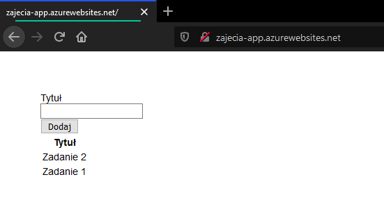

# Programowanie wyświetlania listy zadań

## Materiały

* [Dokumentacja modelu danych usługi Azure Table](https://docs.microsoft.com/en-us/rest/api/storageservices/Understanding-the-Table-Service-Data-Model)
* [Dokumentacja biblioteki moment](https://momentjs.com/)

## Przygotowanie

1. Otwórz [Azure Cloud Shell](https://shell.azure.com) i zaloguj się przez SSH do [maszyny wirtualnej utworzonej na pierwszych zajęciach](./PAA_C01.md):

```sh
ssh <nazwa-użytkownika>@<adres-ip-maszyny-wirtualnej>
```

2. Przejdź do katalogu projektu i przełącz się na gałąź *master*

```sh
cd projekt-paa && git checkout master
```

## Zadanie 1

Na stronie głównej umieść tabelę w której wyświetlane będą wszystkie zadania dodane przez użytkownika aplikacji (zapisane w tabeli `tasks`). Tabela powinna składać się z jednej kolumny, a każdy wiersz powienien zawierać tytuł zadania. Wszystkie zmiany wypchnij do repozytorium projektu w serwisie GitHub.

1. Otwórz plik `views/index.pug` do edycji:

```sh
nano views/index.pug
```

Na końcu bloku `content` (pod formularzem dodawania zadania) dodaj strukturę tabeli:

```pug
table
  tr
    th(scope= "col") Tytuł
  each task in tasks
    tr
      td= task.title
```

Zapisz zmiany i zamknij edytor.

2. Otwórz plik `routes/index.js` do edycji:

```sh
nano routes/index.js
```

Dodaj kod importujący moduł `store.js`:

```js
const store = require('../store')
```

Zamień implementację trasy `/` na następującą:

```js
router.get('/', async (ctx, next) => {
  tasks = await store.listTasks()
  await ctx.render('index', { tasks })
})
```

Zapisz zmiany i zamknij edytor.

3. Otwórz plik `store.js` do edycji:

```sh
nano store.js
```

Dodaj implementację funkcji o nazwie `listTasks`:

```js
const listTasks = async () => (
  new Promise((resolve, reject) => {
    const query = new storage.TableQuery()
      .select(['title'])
      .where('PartitionKey eq ?', 'task')

    service.queryEntities(table, query, null, (error, result, response) => {
      !error ? resolve(result.entries.map((entry) => ({
        title: entry.title._
      }))) : reject()
    })
  })
)
```

Wyeksportuj funkcję `listTasks` z pliku:

```sh
module.exports = {
  init,
  createTask,
  listTasks,
}
```

Zapisz zmiany i zamknij edytor.

4. Zatwierdź zmiany w repozytorium:

```sh
git add --all git commit -m 'Dodano wyświetlanie listy zadań'
```

5. Wypchnij zmiany do repozytorium projektu w serwisie GitHub:

```sh
git push origin master
```

6. Przetestuj działanie aplikacji.

Poczekaj na wdrożenie aplikacji obserwując akcję w zakładce `Actions` w serwisie GitHub. Po pomyślnym wdrożeniu, przejdź na stronę aplikacji i spróbuj dodać nowe zadanie. Sprawdź czy zadania wyświetlają się na liście.



## Zadanie 2

Do formularza dodawania zadania dodaj nowe pole umożliwiające podanie przez użytkownika opisu zadania. Do tabeli z listą zadań dodaj nową kolumnę w której wyświetlany będzie opis zadania. W przypadku gdy opis nie został dodany przez użytkownika, w kolumnie z opisem wyświetl komunikat o jego braku. Wszystkie zmiany wypchnij do repozytorium projektu w serwisie GitHub.

## Zadanie 3

Dodaj kolumnę do tabeli z listą zadań w której wyświetlana będzie data ostatniej modyfikacji zadania. Do formatowania daty i czasu możesz wykorzystać bibliotekę `moment`. Do pobrania ostatniego czasu modyfikacji wykorzystaj klucz systemowy `Timestamp`. Wszystkie zmiany wypchnij do repozytorium projektu w serwisie GitHub.