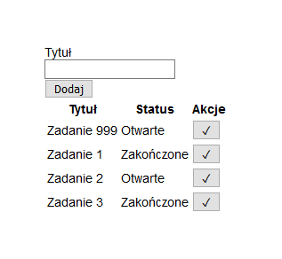

# Programowanie zmiany statusu zadań

## Materiały

* [Dokumentacja SDK azure-storage](https://github.com/Azure/azure-storage-node)
* [Tutorial Fetch API](https://developers.google.com/web/updates/2015/03/introduction-to-fetch)

## Przygotowanie

1. Otwórz [Azure Cloud Shell](https://shell.azure.com) i zaloguj się przez SSH do [maszyny wirtualnej utworzonej na pierwszych zajęciach](./PAA_C01.md):

```sh
ssh <nazwa-użytkownika>@<adres-ip-maszyny-wirtualnej>
```

2. Przejdź do katalogu projektu i przełącz się na gałąź *master*

```sh
cd projekt-paa && git checkout master
```

**Uwaga:** Studenci, którzy wykonali na poprzednich zajęciach zadania na wyższe oceny muszą zachować dotychczasową funkcjonalność aplikacji.

## Zadanie 1

Dodaj do tabeli z listą zadań dwie kolumny w których wyświetlone zostaną status zadania (otwarte, zakończone) oraz przycisk, którego kliknięcie spowoduje zmianę statusu zadania na zakończone. Wypchnij wszystkie zmiany do repozytorium projektu w serwisie GitHub.

1. Otwórz plik `views/index.pug` do edycji:

```sh
nano views/index.pug
```

Dodaj do tabeli dwie kolumny `Status` oraz `Akcje`:

```pug
table
  tr
    th(scope= "col") Tytuł
    th(scope= "col") Status
    th(scope= "col") Akcje
  each task in tasks
    tr
      td= task.title
      td= (task.status == 'completed' ? 'Zakończone' : 'Otwarte')
      td
        button(type="button" onclick=`updateTaskStatus('${task.id}', 'completed')`) ✓
```

Zapisz zmiany i zamknij edytor.

2. Utwórz plik `public/javascripts/index.js` i otwórz go do edycji:

```sh
touch public/javascripts/index.js && nano public/javascripts/index.js
```

Dodaj implementację funkcji o nazwie `updateTaskStatus`:

```js
const updateTaskStatus = (id, status) => {
  fetch('/tasks/updateStatus', {
    method: 'post',
    headers: {
      'Content-Type': 'application/x-www-form-urlencoded; charset=UTF-8'
    },
    body: `id=${id}&status=${status}`
  })
  .finally(() => {
    window.location = '/'
  })
}
```

Zapisz zmiany i zamknij edytor.

3. Otwórz plik `views/layout.pug` do edycji:

```sh
nano views/layout.pug
```

Dodaj następujący kod pod linijką `block content` w sekcji `body`:

```pug
block scripts
```

Zapisz zmiany i zamknij edytor.

4. Otwórz plik `views/index.pug` do edycji:

```sh
nano views/index.pug
```

Dodaj następujący kod na końcu pliku:

```pug
block scripts
  script(src="javascripts/index.js")
```

Zapisz zmiany i zamknij edytor.

5. Otwórz plik `routes/tasks.js` do edycji:

```sh
nano routes/tasks.js
```

Dodaj implementację trasy `updateStatus`:

```js
router.post('/updateStatus', async (ctx, next) => {
  const { id, status } = ctx.request.body
  await store.updateTaskStatus(id, status)
  ctx.status = 200
})
```

Zapisz zmiany i zamknij edytor.

6. Otwórz plik `store.js` do edycji:

```sh
nano store.js
```

Dodaj implementację funkcji o nazwie `updateTaskStatus` odpowiedzialnej za zmianę statusu zadania:

```js
const updateTaskStatus = async (id, status) => (
  new Promise((resolve, reject) => {
    const generator = storage.TableUtilities.entityGenerator
    const task = {
      PartitionKey: generator.String('task'),
      RowKey: generator.String(id),
      status
    }

    service.mergeEntity(table, task, (error, result, response) => {
      !error ? resolve() : reject()
    })
  })
)
```

Zapisz zmiany.

Zamień implementację funkcji `listTasks` aby zwracała status zadania:

```js
const listTasks = async () => (
  new Promise((resolve, reject) => {
    const query = new storage.TableQuery()
      .select(['RowKey', 'title', 'status'])
      .where('PartitionKey eq ?', 'task')

    service.queryEntities(table, query, null, (error, result, response) => {
      !error ? resolve(result.entries.map((entry) => ({
        id: entry.RowKey._,
        title: entry.title._,
        status: entry.status._
      }))) : reject()
    })
  })
)
```

Zapisz zmiany.

Zamień implementację funkcji `createTask` aby ustawiała status nowego zadania:

```js
const createTask = async (title) => (
  new Promise((resolve, reject) => {
    const generator = storage.TableUtilities.entityGenerator
    const task = {
      PartitionKey: generator.String('task'),
      RowKey: generator.String(uuid.v4()),
      title,
      status: 'open'
    }

    service.insertEntity(table, task, (error, result, response) => {
      !error ? resolve() : reject()
    })
  })
)
```

Zapisz zmiany.

Wyeksportuj funkcję `updateTaskStatus` z pliku:

```js
module.exports = {
  init,
  createTask,
  listTasks,
  updateTaskStatus
}
```

Zapisz zmiany i zamknij edytor.

7. Zatwierdź zmiany w repozytorium:

```sh
git add --all && git commit -m 'Dodano możliwość zmiany statusu zadania'
```

8. Wypchnij zmiany do repozytorium projektu w serwisie GitHub:

```sh
git push origin master
```

9. Przetestuj działanie aplikacji.

Poczekaj na wdrożenie aplikacji obserwując akcję w zakładce `Actions` w serwisie GitHub. Po pomyślnym wdrożeniu, przejdź na stronę aplikacji i zmienić status zadania. Sprawdź czy na liście wyświetlany jest poprawny status.



## Zadanie 2

Dodaj do tabeli z listą zadań przycisk umożliwiający usunięcie zadania. Wszystkie zmiany wypchnij do repozytorium projektu w serwisie GitHub.

## Zadanie 3

Posortuj zadania na liście według czasu ostatniej modyfikacji. Wszystkie zmiany wypchnij do repozytorium projektu w serwisie GitHub.