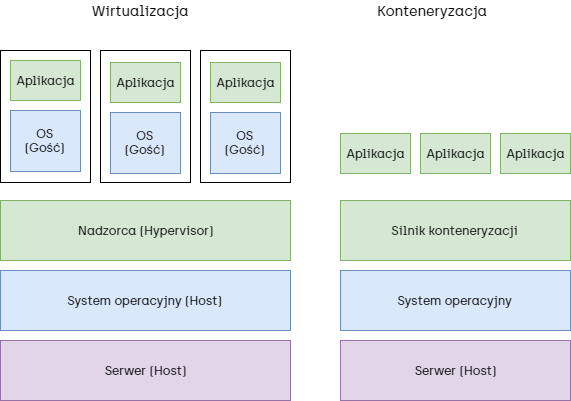
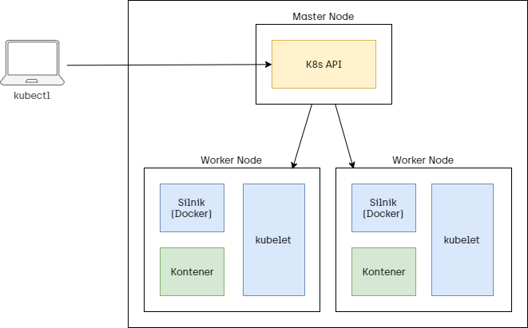

# Hosting aplikacji
Wprowadzenie do konteneryzacji na platformie Azure.

---

**Konteneryzacja** - sposób pakowania kodu oraz wszystkich jego zależności, aby mógł on działać w taki sam sposób na dowolnej infrastrukturze.

---



---

**Docker** - platforma pozwalająca na budowanie, testowanie i wdrażanie aplikacji w kontenerach.

---

**Docker Registry** - platforma do przechowywania i pobierania obrazów platformy Docker.

---

## Azure Container Instances
Usługa pozwalająca na uruchamianie kontenerów w chmurze.

---

### Tworzenie kontenera

```sh
az container create \
  --resource-group <resource-group-name> \
  --name <container-name> \
  --image <container-image> \ # URL mcr.microsoft.com/azuredocs/aci-helloworld
  --dns-name-label <dns-label> \
  --ports 80
```

---

### Wyświetlenie statusu kontenera

```sh
az container show \
  --resource-group <resource-group-name> \
  --name <container-name> \
  --query "{FQDN:ipAddress.fqdn,ProvisioningState:provisioningState}" \
  --output table
```

---

### Wyświetlenie logów kontenera

```sh
az container logs \
  --resource-group <resource-group-name> \
  --name <container-name>
```

---

### Wyświetlenie listy kontenerów

```sh
az container list \
  --resource-group <resource-group-name> \
  --output table
```

---

### Usunięcie kontenera

```sh
az container delete \
  --resource-group <resource-group-name> \
  --name <container-name>
```

---

## Azure Container Registry
Zarządzane i prywatne repozytorium obrazów Docker, oparte na otwartoźródłowej platformie Docker Registry.

---

### Tworzenie rejestru

```sh
az acr create \
  --resource-group <resource-group-name> \
  --name <container-registry-name> \
  --sku Basic
```

---

### Logowanie do rejestru

```sh
az acr login \
  --name <container-registry-name>
```

---

### Wypchnięcie obrazu do rejestru

```sh
# Pobranie obrazu Hello World z repozytorium Docker
docker pull hello-world

# Oznaczenie obrazu
docker tag hello-world <container-registry-server-name>/hello-world:v1

# Wypchnięcie obrazu
docker push <container-registry-server-name>/hello-world:v1
```

---

### Wyświetlenie listy obrazów w rejestrze

```sh
az acr repository list \
  --name <container-registry-name> \
  --output table
```

---

### Uruchomienie obrazu z rejestru lokalnie

```sh
docker run <container-registry-server-name>/hello-world:v1 
```

---

**Kubernetes** - silnik zarządzania kontenerami (ang. container orchestration engine).

---



---

## Azure Kubernetes Service
Zarządzane środowisko Kubernetes na platformie Azure.