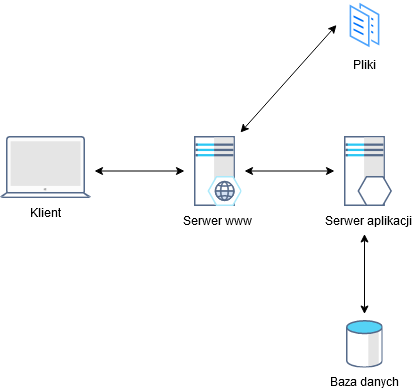
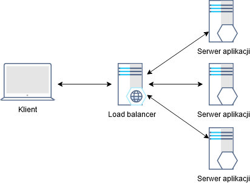
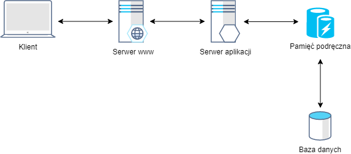

# Wydajność aplikacji
Zwiększanie wydajności aplikacji z wykorzystaniem usług platformy Azure.

---

---

**Skalowanie pionowe** (ang. Vertical scaling, Scale up) - dodanie (lub wymiana) CPU, pamięci RAM, pamięci trwałej, etc. do istniejącej maszyny.

**Skalowanie poziome** (ang. Horizontal scaling, Scale out) - dodanie nowych serwerów (fizycznych lub wirtualnych) do puli zasobów.

---

**Równoważenie obciążenia** (ang. Load balancing) - technika rozpraszania obciążenia na wiele serwerów lub procesorów.

---

---

**Algorytmy równoważenia obciążenia** - algorytmy wykorzystywane przez narzędzia równoważące obciążenie do wyboru, który z serwerów obsłuży nadchodzące żądanie.

* **Round Robin** - żądania rozpraszane są pomiędzy grupę serwerów sekwencyjnie;
* **Least Connections** - żądania przekazywane są do serwera z najmniejszą liczbą połączeń;
* **IP Hash** - adres IP klienta służy do wyznaczenia, który serwer obsłuży żądanie;

---

**Sieć dostarczania treści** (ang. Content Delivery Network, CDN) - geograficznie rozproszona sieć serwerów proxy i powiązanych centrów danych służąca udostępnianiu treści z wysoką wydajnością oraz dostępnością.

---

---

**Pamięć podręczna** (ang. Cache) - komponent sprzętowy lub programowy, który przechowuje dane celem szybszego dostępu w kolejnych zapytaniach.

---

---

**System nazw domen** (ang. Domain Name System, DNS) - hierarchiczny i zdecentralizowany system nazw dla komputerów, usług lub innych zasobów podłączonych do Internetu.

---

---

## Usługi platformy Azure

* Azure Autoscale
* Azure Load Balancer
* Azure CDN
* Azure Traffic Manager
* Azure Front Door
* Azure Redis Cache
* Azure DNS