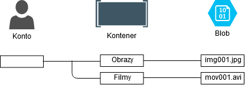
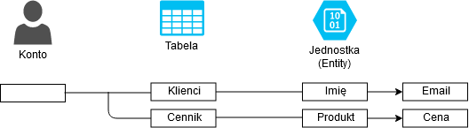
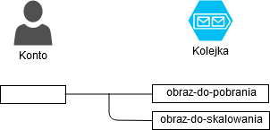
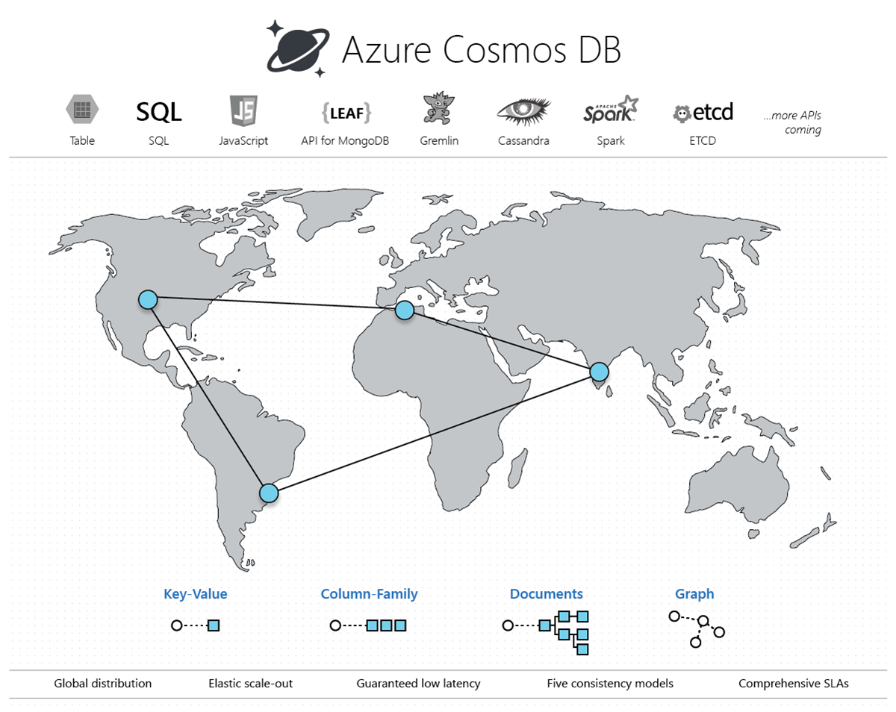

# Magazyny danych
Usługi magazynowania danych na platformie Azure.

---

## Azure Storage

Zestaw usług magazynowania danych dla różnych scenariuszy użycia.

* Azure Blobs
* Azure Files
* Azure Queues
* Azure Tables

---

**Azure Blobs** - usługa do przechowywania dużych zbiorów nieustrukturyzowanych danych, takich jak filmy, obrazy czy dźwięk.
<br/><br/>



---

**Azure Tables** - usługa NoSQL do przechowywania danych typu klucz/wartość w tabelach.
<br/><br/>



---

**Azure Queues** - usługa do przechowywania i pobierania dużej liczby wiadomości.
<br/><br/>



---

**Azure Files** - usługa do udostępniania plików korzystająca z protokołu SMB (Service Message Block).

---

**Azure Disk Storage** - usługa udostępniania wirtualnych dysków twardych.

---

**Konto magazynu** - konto usługi Azure Storage, które zawiera wszystkie obiekty danych usługi Azure Storage: obiekty blob, pliki, kolejki, tabele i dyski; zapewnia unikatową przestrzeń nazw dla danych, która dostępna jest za pośrednictwem protokołu HTTP/HTTPS.

---

## Rodzaje kont magazynów

* **General-purpose v2** - podstawowe konto dla obiektów typu blob, plików, kolejek i tabel; zalecane do większości zastosowań
* **BlockBlobStorage** - konto wyłącznie dla obiektów typu blob, charakteryzuje się większą wydajnością
* **FileStorage** - konto wyłącznie dla plików, charakteryzujące się większą wydajnością

---

## Szyfrowanie danych

* **Szyfrowanie w spoczynku** - dane szyfrowane są automatycznie przed utrwaleniem i odszyfrowywane przed pobraniem
* **Szyfrowanie po stronie klienta** - biblioteki klienta dostarczają metody szyfrujące dane przed wysłaniem ich przez sieć oraz odszyfrowujące po otrzymaniu z sieci

---

## Nadmiarowość danych

* **Magazyn lokalnie nadmiarowy (LRS)** - dane replikowane są trzy razy w regionie
* **Magazyn strefowo nadmiarowy (ZRS)** - dane replikowane są w trzech strefach
* **Magazyn geograficznie nadmiarowy (GRS)** - dane replikowane są asynchronicznie pomiędzy regionami

---

## Tworzenie konta magazynu

```sh
az storage account create \
  --name <account-name> \
  --resource-group <resource-group-name> \
  --location <location> \
  --sku Standard_LRS
```

---

## Pobranie poświadczeń

```sh
az storage account keys list \
  --account-name <account-name> \
  --resource-group <resource-group-name> \
  --output table
```

---

## Tworzenie kontenera

```sh
az storage container create \
  --account-name <account-name> \
  --account-key <account-key> \
  --name <container-name>
```

---

## Przesyłanie obiektów blob

```sh
az storage blob upload \
  --account-name <account-name> \
  --container-name <container-name> \
  --name <blob-name> \
  --file <file-name>
```

---

## Pobieranie obiektów blob

```sh
az storage blob download \
  --account-name <account-name> \
  --container-name <container-name> \
  --name <blob-name> \
  --file <file-name>
```

---

## Wyświetlanie listy obiektów blob

```sh
az storage blob list \
  --account-name <account-name> \
  --account-key <account-key> \
  --container-name <container-name> \
  --output table
```

---

## Tworzenie tabeli

```sh
az storage table create \
  --account-name <account-name> \
  --name <table-name>
```

---

## Wyświetlenie listy tabel

```sh
az storage table list \
  --account-name <account-name>
```

---

## Usunięcie tabeli

```
az storage table delete \
  --account-name <account-name> \
  --name <table-name>
```

---

## Usunięcie konta magazynu

```sh
az storage account delete \
  --name <account-name>
  --resource-group <resource-group-name>
```

---

## Azure Cosmos DB

Globalnie rozproszona, wielomodelowa usługa bazodanowa.

---



---

## Azure SQL Database

Zarządzana i skalowalna baza danych SQL zgodna z Microsoft SQL Server.

---

## Azure dla MySQL, PostgreSQL, MariaDB

Zarządzane i skalowalne bazy danych MySQL, PostgreSQL i MariaDB